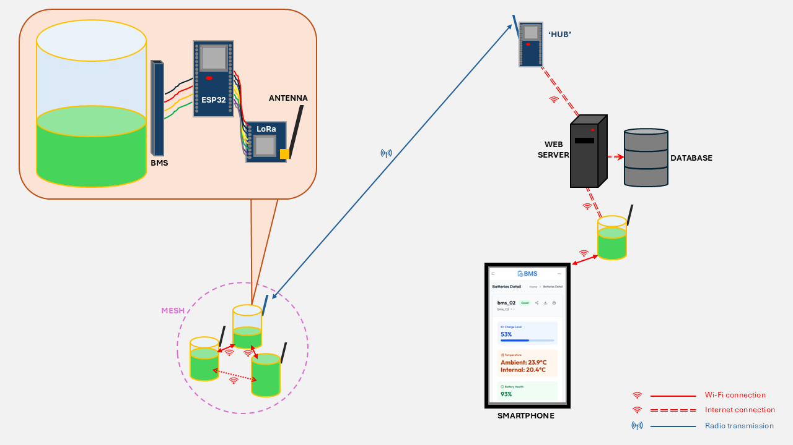

# Remote Monitoring and Optimisation of Energy Storage Systems

## ESP32
Each battery module is interfaced, through a BMS, to an ESP32 microcontroller.
The microcontroller is programmed in `C` with the ESP-IDF framework which is provided and maintained by [Espressif](https://docs.espressif.com/projects/esp-idf/en/stable/esp32/index.html).
The primary aim of each ESP32 is to enable the monitoring and control of each battery module.
In practice, the microcontroller interacts with the BMS rather than directly with the module.
Data is exchanged between the ESP32 and the BMS, but also between the ESP32 and our online web server and / or other ESP32s via Wi-Fi communication.
In scenarios where the module is not within range of a network connection, Wi-Fi communication is replaced by radio transmission.

The diagram below illustrates the components of each individual battery module, as well as all possible forms of information exchange.

### BMS, LoRa and GPS
Shown in the zoomed bubble is a breakdown of one battery module unit.
The battery itself is wired to a battery management system (BMS).
At this point we are working with a four-series-cell lithium-ion battery and a [BQ40Z50-R1](https://www.ti.com/product/BQ40Z50) BMS.
The BMS is then managed by the ESP32 through SMBus communication.
The ESP32 can also simultaneously communicate with the radio LoRa transceiver through a separate SPI connection.
The ESP32 comes pre-loaded with Wi-Fi and Bluetooth capabilities.

#### BMS
Communication with the BMS is achieved using the I2C driver, provided by ESP-IDF.
Defined from this are four core functions:
  * `read_SBS_data` and `write_word`: These read and write small quantites of data (usually one or two bytes) to and from specific addresses within the BMS.
  * `read_data_flash` and `write_data_flash`: These deal with larger exchanges of information stored in the Data Flash on the BMS (up to 32 bytes). The specific address is first transmitted to the BMS to select the information in question, before a read or write command is executed at the Data Flash address.

Building on these are BMS-specific functions designed to make use of the BMS capabilities.
These include the `seal`, `unseal` and `full_access` functions as well as `reset` which alter the state of the BMS.
Battery and individual cell data are obtained from the BMS within the `get_data` function.
This function is called regularly as the ESP32 transmits telemetry data to its WebSocket clients and/or the web server (see section on <b>Networking</b>).

#### LoRA
Communication with the LoRa transceiver is achieved using the SPI driver, provided by ESP-IDF.
Defined from this are two core functions:
  * `lora_read_register` and `lora_write_register`: These read and write singular bytes to and from specific addresses within the LoRa transceiver.

Building on these are functions designed to initialise the LoRa transceiver (see `lora_init` and `lora_configure_defaults`), and transmit/receive radio packets (see `lora_task`, `transmit` and `receive`).

#### GPS
<placeholder>

### Networking
This package makes use of the Wi-Fi capabilities of the ESP32 in multiple ways.
These are detailed below, in order of their chronological implementation in the project.

#### Local HTTP Server
The best way to display telemetry data obtained from the BMS to users is via HTTP pages that can be served to any smartphone or other web-capable device.
This can be achieved by configuring the ESP32 to act as a Wi-Fi access point (AP) to which devices can connect, while simultaneously running a HTTP server.
By adding a DNS server, devices are automatically directed to the IP address of the ESP32 http server, mimicking the captive portals you find when connecting to public Wi-Fi hotspots.

## Webserver backend
<placeholder>

## UI frontend
<placeholder>
